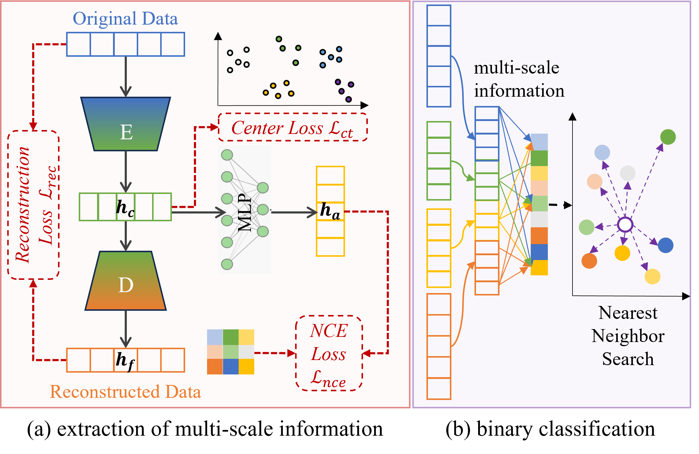

# IF4FD
Code for the paper:
IF4FD: Multi-Scale Information Fusion for Zero-Shot Industrial Fault Diagnosis, IEEE TRANSACTIONS ON INDUSTRIAL INFORMATICS

# IF4FD_Framework


# Reproduce Results
```
python3 IF4FD_main.py
```

# Citing 
```
@article{tang2026if4id,
  title={IF4FD: Multi-Scale Information Fusion for Zero-Shot Industrial Fault Diagnosis},
  author={Tang, Chenwei and Wang, Ying and Wang, Weijia and Ying, Wangyang and Liu, Jie and Wang, Yong and Gong, Nanxu and Ju, Wei and Xiao, Rong and Lv, Jiancheng},
  journal={IEEE Transactions on Industrial Informatics},
  year={2026},
  publisher={IEEE}
}
```
